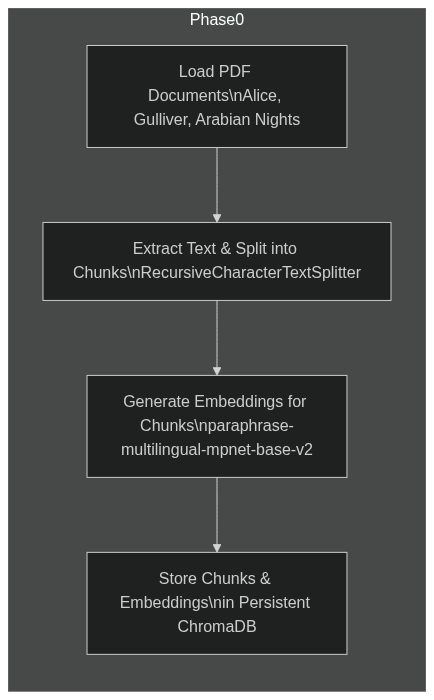
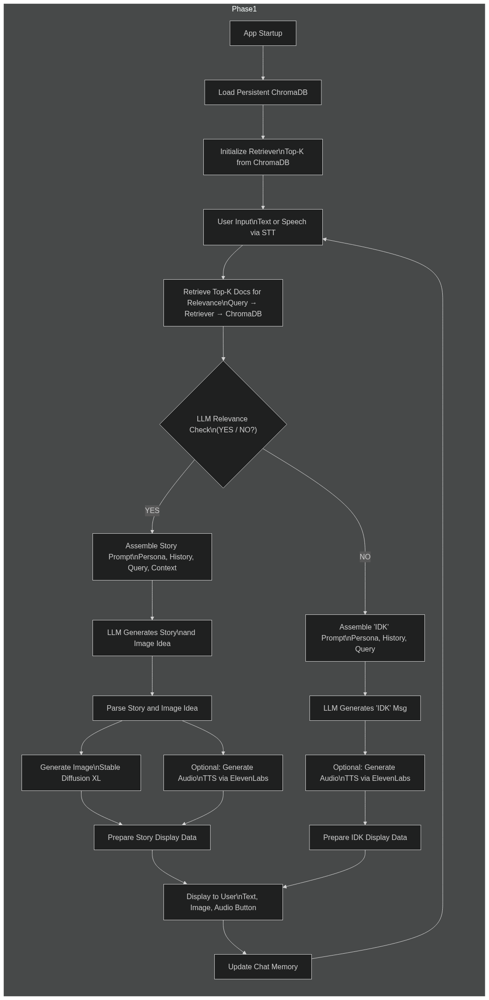

# Langchain-RAG-Funny-Story-Bot.
A Streamlit chatbot using Langchain RAG to tell funny stories from classic books, with STT/TTS and image generation.

## Setup and Installation

Follow these steps to set up and run the project locally:

1.  **Clone the Repository:**
    ```bash
    git clone https://github.com/ShantanuDhadwe/Langchain-RAG-Funny-Story-Bot.
    cd Langchain-RAG-Funny-Story-Bot.
    ```

2.  **Create and Activate a Python Virtual Environment:**
    It's highly recommended to use a virtual environment.
    ```bash
    python -m venv venv
    # On Windows:
    venv\Scripts\activate
    # On macOS/Linux:
    source venv/bin/activate
    ```

3.  **Install Dependencies:**
    ```bash
    pip install -r requirements.txt
    ```
    *   **Note for `PyAudio` (a dependency of `SpeechRecognition`):** If you encounter issues during installation, you might need to install system-level dependencies first.
        *   On Debian/Ubuntu: `sudo apt-get install portaudio19-dev python3-pyaudio`
        *   On macOS: `brew install portaudio && pip install pyaudio`
        *   For other systems, please refer to PyAudio installation guides.

4.  **Set Up API Keys:**
    Create a file named `.env` in the root project directory (i.e., inside `Funny-Storyteller-Chatbot/`). Copy the contents of `.env.example` into `.env` and fill in your actual API keys:
    ```env
    HUGGINGFACEHUB_API_TOKEN="hf_YOUR_HUGGING_FACE_TOKEN"
    ELEVENLABS_API_KEY="YOUR_ELEVENLABS_API_KEY"
    ```
    *   `HUGGINGFACEHUB_API_TOKEN`: Required for the LLM (Mistral-7B-Instruct) and Image Generation (Stable Diffusion XL).
    *   `ELEVENLABS_API_KEY`: Required for Text-to-Speech.

5.  **Place PDF Documents:**
    Ensure the following PDF files (or your versions of them) are placed inside the `documents/` folder:
    *   `Alice_In_Wonderland.pdf`
    *   `Gullivers_Travels.pdf`
    *   `The_Arabian_Nights.pdf`

6.  **Run the Data Ingestion Script:**
    This script will process the PDFs, create embeddings, and build the persistent ChromaDB vector store. This only needs to be run once, or if you change the source documents or embedding model.
    ```bash
    python ingest_data.py
    ```
    This will create the `db/chroma_db/` directory if it doesn't exist.

## Running the Application

Once the setup is complete and the data has been ingested (ChromaDB is populated):

1.  Make sure your virtual environment is activated.
2.  Run the Streamlit application:
    ```bash
    streamlit run app.py
    ```
3.  The application will typically open automatically in your default web browser. If not, the terminal will provide a local URL (usually `http://localhost:8501`).

## Application Flow Summary

1.  **Data Ingestion (Offline):** PDFs are loaded, chunked, embedded, and stored in ChromaDB by `ingest_data.py`.
2.  **App Initialization:** `app.py` loads the ChromaDB, retriever, LLM, and embedding model (using Streamlit caching).
3.  **User Input:** Text or Speech (via STT).
4.  **Context Retrieval:** Top-K document chunks are retrieved from ChromaDB based on the query.
5.  **LLM Relevance Check:** An LLM call determines if the query is answerable from the retrieved context (YES/NO).
6.  **Conditional Response:**
    *   **If Relevant (YES):**
        *   LLM generates a funny story and an image idea based on the context and chat history.
        *   Image is generated using the image idea.
        *   Story text is converted to speech (TTS).
    *   **If Not Relevant (NO):**
        *   LLM generates a funny "I don't know" message based on chat history.
        *   IDK message text is converted to speech (TTS).
7.  **Display:** The bot's response (text, image, audio play button) is displayed in the Streamlit UI.
8.  **Memory Update:** Conversation is saved for context in future turns.

## Visual Application Flow

The following diagram illustrates the overall architecture and data flow of the application:




## Notes

*   The quality of speech recognition can vary depending on microphone quality and ambient noise.
*   LLM responses for relevance and story generation can vary. The prompts are designed to guide the LLM, but occasional deviations might occur.
*   API usage for Hugging Face Endpoints and ElevenLabs may be subject to rate limits or costs depending on your account tiers.
